# 🏛️ Architecture

This document is the deep dive companion to [`README.md`](./README.md). It covers the **layers, the flow of data, the diagrams and the rationale** behind every meaningful decision in the project.

---

## 📑 Table of contents

1. [Guiding principles](#1-guiding-principles)
2. [The three layers at a glance](#2-the-three-layers-at-a-glance)
3. [End-to-end data flow](#3-end-to-end-data-flow)
4. [Data layer](#4-data-layer)
5. [Domain layer](#5-domain-layer)
6. [Presentation layer](#6-presentation-layer)
7. [Dependency injection (Hilt)](#7-dependency-injection-hilt)
8. [Navigation](#8-navigation)
9. [Sequence diagrams](#9-sequence-diagrams)
10. [State lifecycle](#10-state-lifecycle)
11. [Testing strategy](#11-testing-strategy)
12. [Architecture Decision Records (ADR-lite)](#12-architecture-decision-records-adr-lite)

---

## 1. Guiding principles

| Principle                       | How it shows up in the code                                                                |
| ------------------------------- | ------------------------------------------------------------------------------------------ |
| **Single Source of Truth**      | Room is the only source the UI observes. Network calls only update the DB.                 |
| **Offline-first**               | Every screen renders from cache. Refresh is a side-effect, not a blocker.                  |
| **Unidirectional data flow**    | UI emits `Action`s, the ViewModel produces a new `UiState`. No two-way binding.            |
| **Dependency inversion**        | `domain/` defines repository interfaces; `data/` implements them. Inner layers know nothing about outer ones. |
| **Pure domain models**          | Domain models have zero Android / Room / Retrofit imports. They could compile on the JVM alone. |
| **Composition over inheritance**| `StateViewModel<S, A>` is the single base; everything else composes via interfaces.        |
| **Pragmatism over dogma**       | No Use Cases when they would be pure passthroughs. No Paging 3 until manual pagination hurts. |

---

## 2. The three layers at a glance

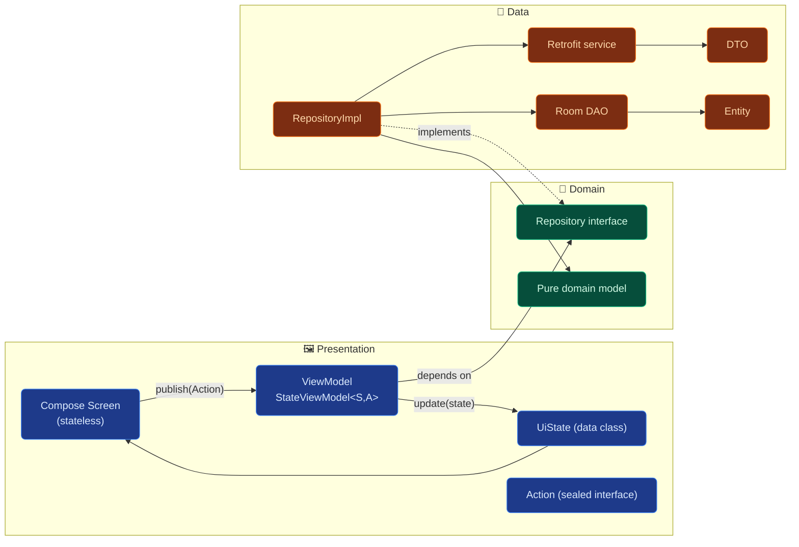

**Reading the diagram:** Presentation depends on Domain. Data depends on Domain. **Domain depends on nothing.** This is the *Dependency Rule* of Clean Architecture.

---

## 3. End-to-end data flow

The app is **offline-first**: the UI subscribes to Room, and the network is just a side-channel that updates the DB. Room then pushes the new rows back to the UI automatically.

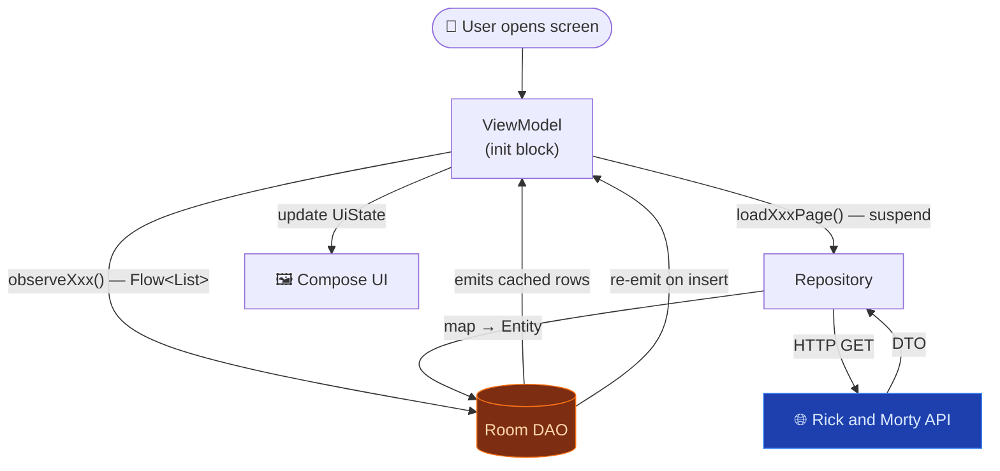

**Why this loop is robust:**

- Cold-start with empty cache → `observeXxx()` emits `[]` immediately, the ViewModel triggers `loadXxxPage(1)`, the API responds, Room is written, and the same Flow re-emits with data. The UI never blocks waiting for the network.
- Cold-start with cache → `observeXxx()` emits cached rows instantly, the ViewModel may still trigger a background refresh.
- Pull-to-refresh → fires `loadXxxPage(1)` again; the cached UI keeps showing while the request is in flight.

---

## 4. Data layer

### 4.1 Responsibility

Owns **all I/O**: HTTP calls, SQL persistence, JSON parsing, mappers between wire-format ⇄ DB-format ⇄ domain-format. Exposes only domain-shaped data through repository implementations.

### 4.2 Sub-packages

| Package          | Contents                                                                  |
| ---------------- | ------------------------------------------------------------------------- |
| `data/remote`    | `RickAndMortyService` (Retrofit), DTOs, DTO→Domain mappers                |
| `data/local`     | `CharacterDatabase` (Room), entities, DAOs, Entity↔Domain mappers         |
| `data/repository`| `CharacterRepositoryImpl`, `EpisodeRepositoryImpl`, `LocationRepositoryImpl` |
| `data/di`        | Hilt modules: `RetrofitModule`, `RoomModule`, `DataModule`, `CoroutineModule` |

### 4.3 The offline-first read/write paths

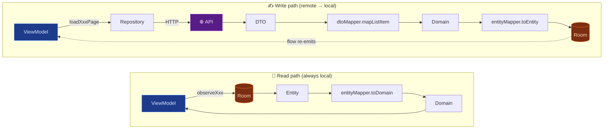

> ✨ **Key insight:** Reads and writes are decoupled. The UI never awaits the network — it awaits Room.

### 4.4 Database schema

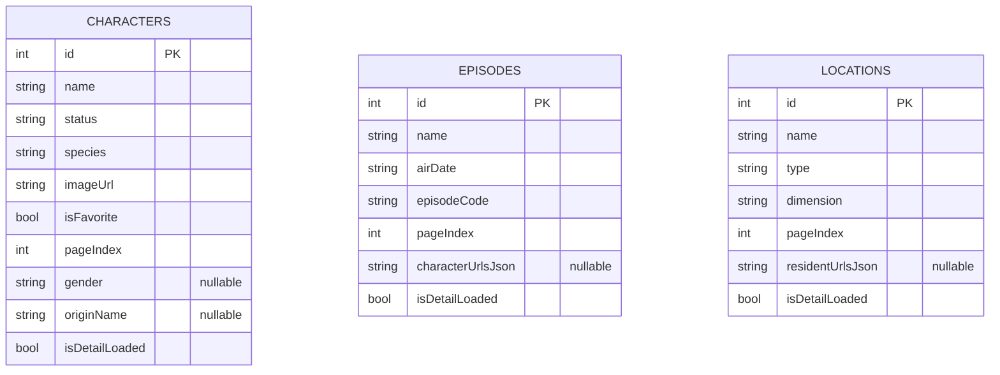

> The three tables are **independent** — there are no SQL relations. Cross-entity links (a character's episodes, a location's residents) live as **URL lists** because the API itself models them that way. This avoids brittle FK migrations as the API evolves.

### 4.5 The "List/Detail fields" pattern

Every entity is split into two zones:

```kotlin
data class CharacterEntity(
    // ── List zone (always populated after a page load) ─────────
    val id: Int,
    val name: String,
    val status: String,
    val species: String,
    val imageUrl: String,
    val isFavorite: Boolean,
    val pageIndex: Int,
    // ── Detail zone (nullable, filled after a detail fetch) ────
    val gender: String? = null,
    val originName: String? = null,
    val locationName: String? = null,
    val isDetailLoaded: Boolean = false
)
```

When the detail screen opens, the ViewModel inspects `isDetailLoaded` and skips the network call if the detail is already cached. This makes back-navigation instant.

### 4.6 Error handling

Repositories return `Result<T>` (Kotlin's stdlib `Result`):

```kotlin
override suspend fun loadCharactersPage(page: Int, name: String?): Result<Int> =
    withContext(dispatcher) {
        runCatching {
            val response = service.getCharacters(page, name)
            when {
                response.code() == HTTP_NOT_FOUND -> 0     // empty search ≠ error
                !response.isSuccessful -> error("HTTP ${response.code()}")
                else -> { /* map + persist */ }
            }
        }
    }
```

- **404 from search** is treated as *"no items found"*, not as a failure — this is an API quirk, not an app error.
- **Real failures** (network, 5xx) bubble up as `Result.failure`, and the ViewModel surfaces a human-readable error in `UiState`.

---

## 5. Domain layer

### 5.1 Responsibility

The domain layer is the **contract** of the app. It defines:

- **Models** — what a `Character`, `Episode`, `Location` looks like in business terms.
- **Repository interfaces** — what operations are available, without saying *how*.

It has **zero dependencies** on Android, Room, Retrofit or Compose. Open `domain/` in IntelliJ and it would compile as a plain Kotlin module.

### 5.2 Why no Use Cases?

A Use Case is justified when it encapsulates logic that **doesn't belong in any single repository** — orchestration across repositories, business rules, complex flow transformations, or reusable logic shared by ≥2 ViewModels.

Today, every ViewModel call is a **1:1 passthrough** to a single repository method:

```kotlin
// What a Use Case would look like here:
class LoadCharactersPageUseCase(private val repo: CharacterRepository) {
    suspend operator fun invoke(page: Int, name: String?) =
        repo.loadCharactersPage(page, name)  // ← literally just forwards
}
```

That's a wrapper, not a use case. Adding 21 such files (one per ViewModel method) would inflate the codebase without adding semantics. The **first Use Case will be added** the day a feature requires real orchestration (e.g. *"show characters that appear in this episode"* would need `CharacterRepository` + `EpisodeRepository` + URL parsing).

> 📖 Google's official Android architecture guide explicitly states the domain layer is **optional** and warns against introducing it pre-emptively. See [developer.android.com/topic/architecture/domain-layer](https://developer.android.com/topic/architecture/domain-layer).

### 5.3 Models

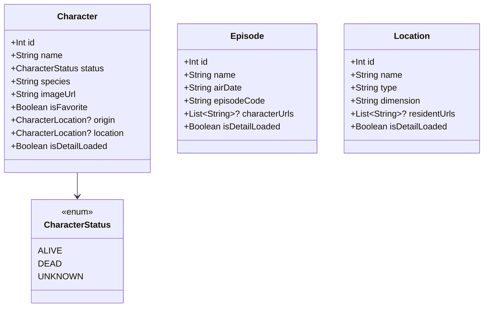

---

## 6. Presentation layer

### 6.1 The MVI loop

Every screen is built around a strict, unidirectional loop:

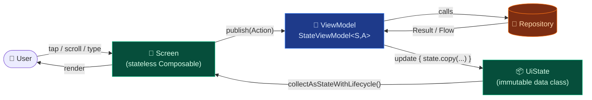

### 6.2 The `StateViewModel<S, A>` base

A small abstraction that all ViewModels extend:

```kotlin
abstract class StateViewModel<S, A>(initialState: S) : ViewModel() {
    private val _state = MutableStateFlow(initialState)
    val state: StateFlow<S> = _state.asStateFlow()

    abstract fun publish(action: A)
    protected fun update(reducer: (S) -> S) { _state.update(reducer) }
    protected fun launch(block: suspend CoroutineScope.() -> Unit) =
        viewModelScope.launch { block() }
}
```

This gives every ViewModel:

- A **typed** `state: StateFlow<S>`.
- A **single entry point** `publish(action: A)` for user intents.
- A reducer-style `update { ... }` that guarantees immutability.
- Exhaustive `when` checks on the `Action` sealed interface — no silently unhandled events.

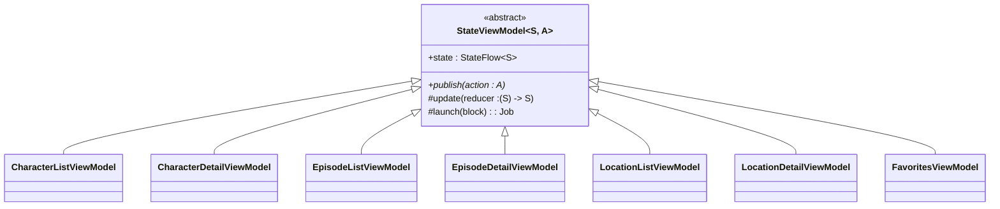

### 6.3 Feature-grouped packaging

Every feature owns three files **co-located** in its own subpackage:

```
viewmodel/
├── characterDetail/
│   ├── CharacterDetailViewModel.kt
│   ├── CharacterDetailUiState.kt
│   └── CharacterDetailAction.kt
├── characterList/
│   ├── CharacterListViewModel.kt
│   ├── CharacterListUiState.kt
│   └── CharacterListAction.kt
├── episodeDetail/  ...
├── episodeList/    ...
├── favorites/      ...
├── locationDetail/ ...
└── locationList/   ...
```

**Why:** opening one folder gives you the complete vocabulary of one feature. Renaming, deleting or moving a feature is a single folder operation. This scales much better than three flat folders (`viewmodel/`, `state/`, `action/`) where related files drift apart over time.

### 6.4 Stateless screens, stateful ViewModels

Every screen composable accepts plain data and lambdas — never a ViewModel directly:

```kotlin
@Composable
fun CharacterListScreen(
    uiState: CharacterListUiState,           // ← pure data in
    onAction: (CharacterListAction) -> Unit, // ← intent out
    onCharacterClick: (Int) -> Unit
) { /* … */ }
```

This makes the screens trivially **previewable** with `@Preview` (see `presentation/screen/preview/PreviewSamples.kt`) and **testable** with Compose UI tests, without ever instantiating Hilt.

The wiring lives in the navigation graph:

```kotlin
composable(Route.CharacterList.path) {
    val vm: CharacterListViewModel = hiltViewModel()
    val uiState by vm.state.collectAsStateWithLifecycle()
    CharacterListScreen(
        uiState = uiState,
        onAction = vm::publish,
        onCharacterClick = { id -> navController.navigate(Route.CharacterDetail.build(id)) }
    )
}
```

---

## 7. Dependency injection (Hilt)

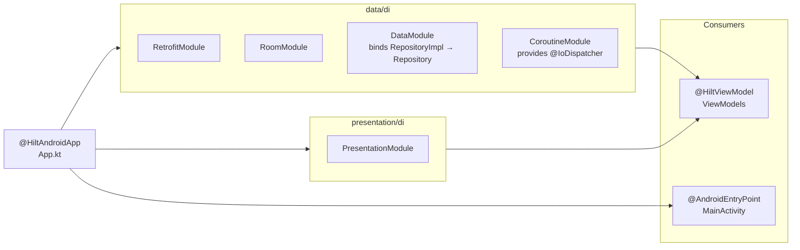

| Module               | Provides                                                                        |
| -------------------- | ------------------------------------------------------------------------------- |
| `RetrofitModule`     | `OkHttpClient`, `Retrofit`, `RickAndMortyService`                               |
| `RoomModule`         | `CharacterDatabase`, `CharacterDao`, `EpisodeDao`, `LocationDao`                |
| `DataModule`         | `@Binds` for the three `Repository` interfaces                                  |
| `CoroutineModule`    | `@IoDispatcher CoroutineDispatcher`                                             |
| `PresentationModule` | Reserved for presentation-scoped helpers (placeholder for future expansion)     |

ViewModels are constructor-injected via `@HiltViewModel` and resolved by `hiltViewModel()` in the navigation graph — no manual factories.

---

## 8. Navigation

A **single Activity** hosts a `NavHost` with one composable per destination. Routes are defined as a sealed class for type safety:

```kotlin
sealed class Route(val path: String) {
    data object CharacterList : Route("character_list")
    data object Favorites : Route("favorites")
    data object LocationList : Route("location_list")
    data object EpisodeList : Route("episode_list")

    data object CharacterDetail : Route("character_detail/{characterId}") {
        const val ARG_CHARACTER_ID = "characterId"
        fun build(characterId: Int): String = "character_detail/$characterId"
    }
    // … and the same for Location/Episode detail
}
```

Detail ViewModels read their `Int` argument from `SavedStateHandle`, keeping them survivable across process death without the extra ceremony of `assistedInject`:

```kotlin
private val characterId: Int =
    checkNotNull(savedStateHandle[Route.CharacterDetail.ARG_CHARACTER_ID]) {
        "CharacterDetailViewModel requires a valid characterId in SavedStateHandle"
    }
```

The four top-level destinations are exposed via a `BottomNavBar`. Detail destinations are pushed onto the back stack from list items.

---

## 9. Sequence diagrams

### 9.1 Cold start: opening the character list with empty cache

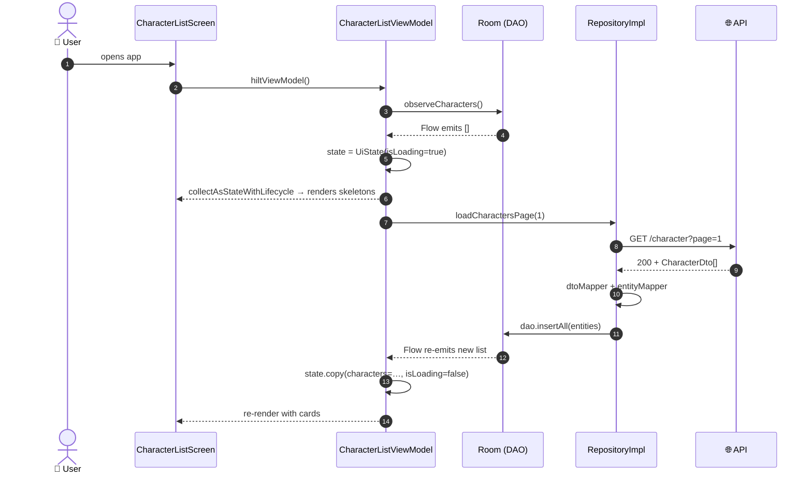

### 9.2 Toggling a favorite from the detail screen

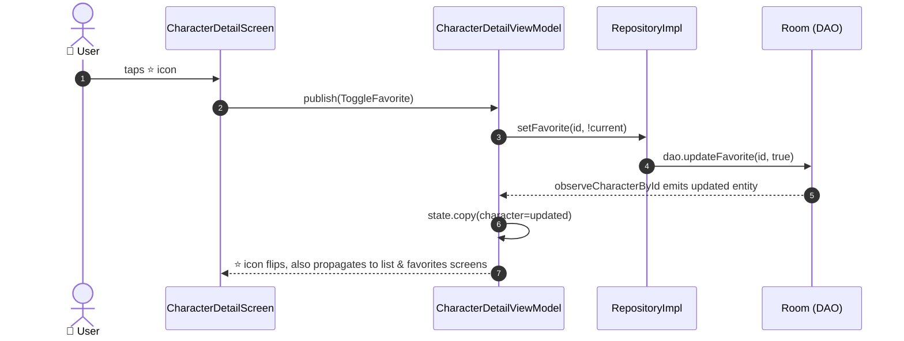

> 🌀 **Why this is elegant:** because Room is the SoT, **every other open screen** (list, favorites) re-renders automatically. No manual cross-VM communication is needed.

### 9.3 Search with debouncing

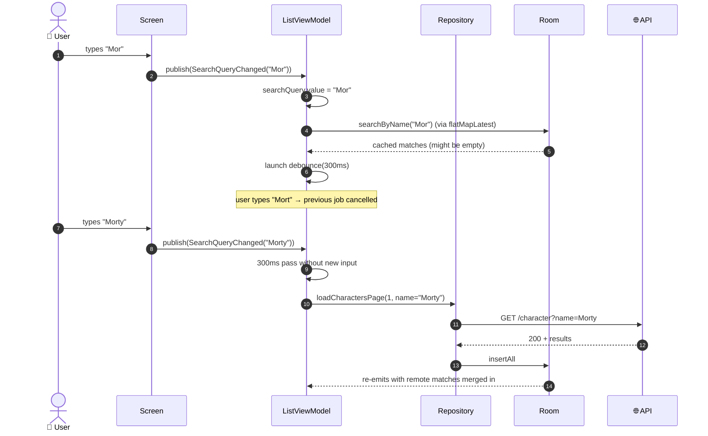

---

## 10. State lifecycle

The detail-screen `UiState` follows a small, predictable state machine:

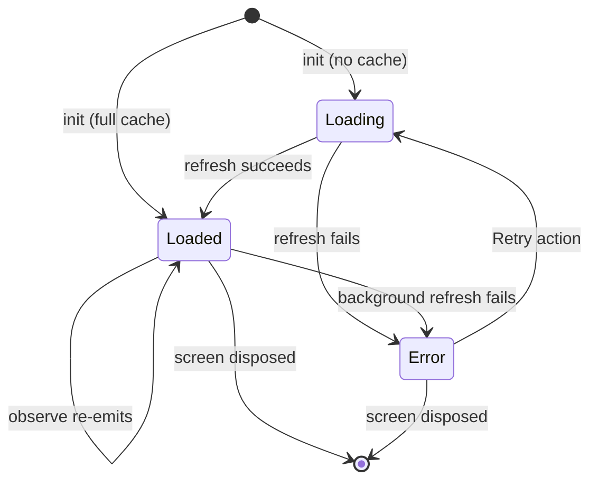

Implementation is just a `data class` with three optional fields (`character`, `isLoading`, `error`); the diagram above is the *meaning* the ViewModel enforces.

---

## 11. Testing strategy

### 11.1 What is tested

| Layer        | What                                                              | How                                                                   |
| ------------ | ----------------------------------------------------------------- | --------------------------------------------------------------------- |
| **Data**     | Mappers (DTO↔Domain, Entity↔Domain), repository implementations   | Pure JVM tests with MockK on `Service` and `Dao`                      |
| **Domain**   | *(not tested directly — pure data classes / interfaces)*          | —                                                                     |
| **Presentation** | Every ViewModel — initial state, action handling, error paths | JVM tests + `MainDispatcherRule` + MockK on the repository            |

### 11.2 What is **not** tested (intentionally)

- **Compose UI** — screens are stateless and trivially previewable; UI tests are on the roadmap if regressions appear.
- **Hilt graphs** — we trust `hilt-compiler` to fail at build time on misconfiguration.
- **Retrofit / Room generated code** — covered by the upstream libraries.

### 11.3 The `MainDispatcherRule`

A custom JUnit 4 rule swaps `Dispatchers.Main` for an `UnconfinedTestDispatcher` so that coroutines launched in `viewModelScope` execute eagerly inside `runTest`:

```kotlin
class MainDispatcherRule(
    val testDispatcher: TestDispatcher = UnconfinedTestDispatcher()
) : TestWatcher() {
    override fun starting(description: Description) = Dispatchers.setMain(testDispatcher)
    override fun finished(description: Description) = Dispatchers.resetMain()
}
```

This lets ViewModel tests assert state **synchronously** after `publish(...)` without sprinkling `advanceUntilIdle()` everywhere.

### 11.4 Test layout mirrors source

Test packages mirror production packages exactly. This is a deliberate convention: `Cmd+Shift+T` (or *Navigate to Test*) always lands on the right file.

---

## 12. Architecture Decision Records (ADR-lite)

Concise rationale for each non-obvious technical choice. Each entry is **2–3 sentences**: the decision and *why this over the alternatives*.

| # | Decision | Rationale |
|---|---|---|
| **ADR-1** | **Offline-first with Room as SoT** | Network is unreliable on mobile; UI should never block on it. The Flow API of Room makes "subscribe to data, refresh in the background" trivial. |
| **ADR-2** | **MVI over plain MVVM** | A single immutable `UiState` per screen + a sealed `Action` set produces exhaustive, debuggable, testable interactions. Plain MVVM with a dozen `LiveData` fields scales worse and hides illegal state combinations. |
| **ADR-3** | **No Use Cases for now** | Every current ViewModel call is a 1:1 passthrough to a repository. Wrapping each one in a Use Case would add boilerplate without semantics. The first orchestrating use case will trigger introducing the pattern. |
| **ADR-4** | **`Result<T>` instead of throwing** | Suspending functions either complete or fail; representing failure as a value forces ViewModels to handle it explicitly with `onSuccess` / `onFailure`. No silent crashes from forgotten try/catch. |
| **ADR-5** | **Hilt over Koin / manual DI** | Hilt's compile-time validation catches most graph errors before they ship. The added build cost is acceptable for a project of this size and is the de-facto Android default. |
| **ADR-6** | **Room over DataStore for local cache** | DataStore is for small key-value preferences; Room is built for queryable, observable lists with pagination — exactly our use case. |
| **ADR-7** | **Group ViewModels by feature, not by type** | Co-locating `XxxViewModel` + `XxxUiState` + `XxxAction` makes feature work a single-folder operation. The flat alternative (`viewmodel/`, `state/`, `action/`) scatters related changes across three places. |
| **ADR-8** | **`SavedStateHandle` for nav arguments** | Detail VMs survive process death without `@AssistedInject` ceremony. Hilt's `@HiltViewModel` already injects `SavedStateHandle` automatically. |
| **ADR-9** | **404 = empty, not error** | The Rick and Morty API returns HTTP 404 on empty search results. Treating it as an error would surface red banners on legitimate "no matches" cases. |
| **ADR-10** | **Manual pagination over Paging 3** | The API is small (≤ 51 episodes, ≤ 126 locations, ≤ 826 characters) and requires no `RemoteMediator` complexity. Paging 3 is on the roadmap if scope grows. |
| **ADR-11** | **`StateViewModel<S, A>` base class** | Centralises the boilerplate of `MutableStateFlow` + `update {}` + `launch {}` so each concrete ViewModel only contains business logic. Saves ~10 lines per VM. |
| **ADR-12** | **Three independent Room tables, no FK relations** | The API itself returns cross-references as URL strings, not IDs. Storing URLs avoids brittle migrations every time the API changes its routing. |
| **ADR-13** | **Stateless screens, ViewModel wired in NavGraph** | Screens accept `(uiState, onAction)`; `hiltViewModel()` lives in the nav graph. This makes screens trivially previewable, testable and reusable. |
| **ADR-14** | **`UnconfinedTestDispatcher` for VM tests** | Lets tests assert state synchronously after `publish(...)` — no `advanceUntilIdle()` noise. The trade-off (less realistic ordering) is acceptable for unit tests of pure state transitions. |

---

## 📚 Further reading

- [Guide to app architecture — Android Developers](https://developer.android.com/topic/architecture)
- [Domain layer — Android Developers](https://developer.android.com/topic/architecture/domain-layer) *(explicitly says it's optional)*
- [Now in Android](https://github.com/android/nowinandroid) — Google's flagship reference app
- [Effective Android — MVI patterns](https://hannesdorfmann.com/android/model-view-intent/)
- [Roman Elizarov — Coroutines best practices](https://elizarov.medium.com/)

---

> 🛸 *Wubba lubba dub dub.*

