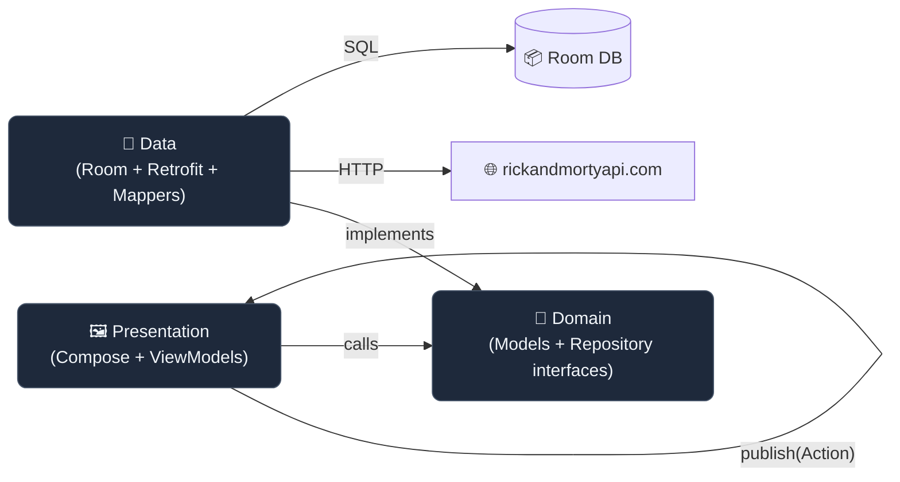

# Rick and Morty 🛸

[](https://kotlinlang.org)
[](https://developer.android.com/build)
[](https://developer.android.com/about/versions/nougat)
[](https://developer.android.com/about/versions/14)
[](https://developer.android.com/jetpack/compose/bom/bom-mapping)

A modern, offline-first Android client for the [Rick and Morty API](https://rickandmortyapi.com), built with Jetpack Compose, Hilt, Room and Retrofit. Designed as a reference implementation of **Clean Architecture + MVI** with a strong focus on testability and minimalism.

> 📖 **For the full architectural breakdown, design diagrams and rationale behind every decision, see [`ARCHITECTURE.md`](./ARCHITECTURE.md).**

---

## ✨ Features

- 📋 **Browse** characters, episodes and locations with paginated lists.
- 🔍 **Search** with debouncing and offline-first cache lookup.
- 📄 **Detail screens** with lazy loading of full payloads.
- ⭐ **Favorites** management persisted locally.
- 🔄 **Pull-to-refresh** and retry on error.
- 🎨 **Material 3** UI with shimmer placeholders and edge-to-edge support.
- 🛜 **Offline-first**: every screen works without connectivity once data is cached.

---

## 🛠️ Tech stack

| Area              | Library                                                                     |
| ----------------- | --------------------------------------------------------------------------- |
| **UI**            | Jetpack Compose · Material 3 · Coil                                         |
| **Architecture**  | Clean Architecture · MVI · ViewModel                                        |
| **DI**            | Hilt                                                                        |
| **Networking**    | Retrofit · OkHttp · Gson                                                    |
| **Persistence**   | Room                                                                        |
| **Async**         | Kotlin Coroutines · Flow · StateFlow                                        |
| **Navigation**    | Navigation Compose                                                          |
| **Testing**       | JUnit 4 · MockK · Turbine · `kotlinx-coroutines-test` · `arch-core-testing` |

Exact versions are pinned in [`gradle/libs.versions.toml`](./gradle/libs.versions.toml).

---

## 🏗️ High-level architecture



Three classic layers, dependencies pointing inwards. Room is the **single source of truth**; the network is treated as a refresh mechanism.

> 📐 See [`ARCHITECTURE.md`](./ARCHITECTURE.md) for detailed per-layer breakdowns, sequence diagrams, ER diagrams and the full list of design decisions.

---

## 📁 Project structure

```
app/src/main/java/com/mickyzg/rickandmorty/
├── data/                       # 💾 Data layer
│   ├── di/                     #    Hilt modules (Retrofit, Room, Coroutines)
│   ├── local/                  #    Room: entities, DAOs, mappers
│   ├── remote/                 #    Retrofit: service, DTOs, mappers
│   └── repository/             #    Repository implementations
│
├── domain/                     # 🧩 Domain layer
│   ├── model/                  #    Pure Kotlin domain models
│   └── repository/             #    Repository interfaces (the API of the domain)
│
├── presentation/               # 🖼️ Presentation layer
│   ├── base/                   #    StateViewModel<S, A> — MVI base
│   ├── component/              #    Reusable Compose UI building blocks
│   ├── di/                     #    Presentation-scoped Hilt module
│   ├── navigation/             #    NavGraph + Route + BottomNavBar
│   ├── screen/                 #    Stateless screen composables
│   └── viewmodel/              #    Feature-grouped ViewModels
│       ├── characterDetail/    #    ViewModel + UiState + Action
│       ├── characterList/
│       ├── episodeDetail/
│       ├── episodeList/
│       ├── favorites/
│       ├── locationDetail/
│       └── locationList/
│
├── ui/theme/                   # 🎨 Material 3 theme
├── App.kt                      # @HiltAndroidApp entry point
└── MainActivity.kt             # Single-activity host
```

---

## 🚀 Getting started

### Requirements

- **Android Studio Narwhal** (or any version compatible with AGP 9.1.x)
- **JDK 17** (Gradle daemon JVM is pinned via `gradle/gradle-daemon-jvm.properties`)
- **Android SDK 36**

### Run

```bash
# Clone
git clone https://github.com/<your-user>/RickAndMorty.git
cd RickAndMorty

# Build the debug APK
./gradlew assembleDebug

# Install on a connected device / emulator
./gradlew installDebug

# Run unit tests
./gradlew testDebugUnitTest
```

> ✅ **No API key required.** The Rick and Morty API is fully public — `local.properties` is only used for the SDK path.

### Useful Gradle commands

| Command                                   | Purpose                                 |
| ----------------------------------------- | --------------------------------------- |
| `./gradlew testDebugUnitTest`             | Run all JVM unit tests                  |
| `./gradlew lintDebug`                     | Static analysis                         |
| `./gradlew app:dependencies`              | Dependency graph                        |
| `./gradlew :app:bundleRelease`            | Build release AAB (signing required)    |

---

## 🧪 Testing

The project includes JVM unit tests for both ViewModels and Repositories. Tests mirror the production package structure for easy navigation:

```
app/src/test/java/com/mickyzg/rickandmorty/
├── data/
│   ├── mapper/                 # CharacterDtoMapperTest, CharacterEntityMapperTest
│   └── repository/             # 3× RepositoryImplTest (Character, Episode, Location)
├── presentation/viewmodel/
│   ├── characterDetail/        # 1× VM test
│   ├── characterList/          # 1× VM test
│   ├── episodeDetail/          # 1× VM test
│   ├── episodeList/            # 1× VM test
│   ├── favorites/              # 1× VM test
│   ├── locationDetail/         # 1× VM test
│   └── locationList/           # 1× VM test
└── util/MainDispatcherRule.kt  # Reusable JUnit4 rule for coroutine dispatcher
```

**Stack:** JUnit 4 + MockK + `kotlinx-coroutines-test`. ViewModels use a custom `MainDispatcherRule` with `UnconfinedTestDispatcher` so coroutines launched in `viewModelScope` execute eagerly — no `advanceUntilIdle()` boilerplate needed.

---

## 🗺️ Roadmap

Possible future enhancements — none required for the current scope:

- 🔄 Replace manual pagination with **Jetpack Paging 3** + `RemoteMediator`.
- 🔗 Cross-feature navigation (e.g. *"see characters in this episode"*) — would justify introducing the first **Use Case**.
- 📊 Add **WorkManager** for periodic background sync of favorites.
- 🌍 i18n / multi-language support.
- 🧪 Add Compose UI tests with `createAndroidComposeRule`.
- 📈 Add code coverage reporting (Kover / JaCoCo).

---

## 🙏 Credits

- [Rick and Morty API](https://rickandmortyapi.com) by [Axel Fuhrmann](https://github.com/afuh) — the wonderful public REST API powering this app.
- All character artwork © Adult Swim. This app is a non-commercial portfolio project and not affiliated with the rights holders.

---

## 📄 License

```
MIT License — see LICENSE for details.
```

